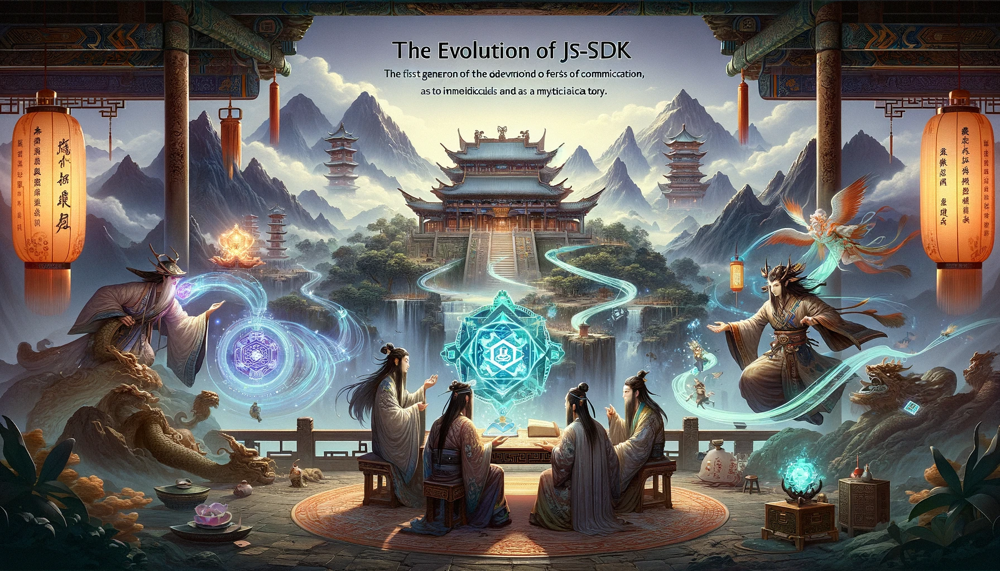

在遥远的天际，存在着一个知识与魔法交织的奇幻土地，名为 **蓬莱**。在这片土地上，一切皆有可能，无论是深藏于图书馆的古老知识，还是流传于民间的神奇传说，都充满了未知与奇迹。

因为这里的神奇，其他土地的人也很乐意来这里探索，但不同土地的环境不一样，导致了一系列的问题，这些问题都被解决或正在解决中。

## 人物介绍

- **夸克**，作为图书馆的守护者，不仅拥有守护知识的责任，还怀揣着改变世界的梦想。
- **白泽** 是一位机关大师，一个博学的符文与阵法爱好者。

- **青鸟** 和 **雨燕**是图书馆的常客，他们喜欢探索知识的海洋，但每次进入图书馆的繁琐程序让他们感到厌烦。

## 第一章：构建身份卡

一天，青鸟，雨燕和 夸克三个人聚餐时，谈起了进图书馆的一个麻烦事，那就是繁琐的入馆程序。

每次进入都要填一堆表格，还要出示各种证件，青鸟不禁抱怨：“为何每次进入图书馆都要重复这些繁琐的步骤呢？这实在是太麻烦了！”。雨燕也同感，并感叹道：“是啊，能不能有一种方法，既能保证安全，又能让我们轻松进出呢？”

夸克想了想道：“这些都是必要的步骤，都是为了确保里面珍贵的书籍不被破坏。不过我们可以制作一种身份卡，搭配通行令牌，只需轻轻一刷就能验证身份并进入图书馆。”

青鸟和雨燕听了后，都觉得这很不错。于是，夸克找到了他的朋友白泽，一起研究。

利用古老的阵法和神秘的符文，夸克和白泽制作出了第一代身份卡，不仅使他们进出图书馆变得轻松，还大大提高了访问效率。

很快，这项技术在蓬莱土地上广为传播，越来越多的地方开始采纳这种便捷的身份验证方式。

邻近的 **瀛州** 和 **方丈** 土地的居民也开始渴望拥有这样的技术。夸克和白泽慷慨地分享了他们的发明，提供了身份卡的制作工艺，使更多的人受益于这项技术。

## 第二章：跨土地身份互通

随着身份卡在蓬莱及邻近土地瀛州和方丈的广泛应用，一个新的挑战出现了。瀛州土地的居民带着他们的身份卡来到蓬莱，却发现这些卡片在蓬莱并不被接受。

这造成了不小的困扰，居民们不愿意为每到一个土地就申请一张身份卡，如果去的地方越多，身份卡的数量也会越来越多，这样不仅携带麻烦，还可能极易丢失。

面对这个问题，夸克和白泽又开始商量起来。他们意识到，要真正实现跨土地的无缝连接，必须创造一种身份互通的机制，也就是 “魔法桥梁”。

经过共同商议，决定通过建立一个中央身份验证系统来解决这一问题。这个系统将允许不同土地的身份卡互相认证，确保居民能够在各个土地之间自由流动。

白泽提出，这需要一个复杂的数据共享和同步机制，来确保各个土地的身份信息实时更新且安全。他们决定利用一种先进的“令牌交换协议”，这种协议允许不同系统间安全地交换身份信息，而不会泄露敏感数据。

在夸克和白泽的共同努力下，这一系统终于建立起来。现在，瀛州的居民们可以带着他们的身份卡自由地访问蓬莱，他们的卡片会自动接收来自蓬莱的通行令牌。这意味着他们可以使用同一张身份卡，在多个土地间自由地、安全地流动。

## 第三章：个人物品存储

随着身份卡系统的成功实施，蓬莱土地及其邻近土地之间的交流变得日益频繁。瀛州地区的居民为了下次访问时减少所需携带的物品，开始在蓬莱广场附近的空地上存放个人物品。这个做法很快被许多到蓬莱的居民采用，他们也开始在这个空地上存放自己的物品。

然而，随着时间的推移，这个临时存放地开始出现问题。由于所有人都是按照 “先到先得” 的原则放置物品，物品的所有权和位置常常引发纠纷。每当有人返回蓬莱时，他们发现自己的物品不见了，或者被其他人错误地认领，这导致了一系列混乱和不满。

为了解决这个问题，夸克提出了一个解决方案。他决定在蓬莱广场附近建立一个标准化的仓库系统。在这个系统中，每个人都将拥有一个独立的存储空间，用以存放他们的物品，确保每个人都只能访问自己的存储空间。

目前还在测试中，正在整理一些守则，寻找和招募测试人员。。。

## 第四章：跨土地信息共享

经过一段时间相处，方丈和瀛州等外来居民发现了一个新的问题：虽然他们可以自由进入蓬莱，但却常常错过重要的活动。

这是因为蓬莱的活动信息只通知本土居民，外来者难以获取这些及时的信息。

这个问题又一次被反馈给 夸克，夸克耐心倾听后，也明白他们的想法。可这与令牌不一样，之前是他们主动来拿，令牌可以直接签发，生成一个最新的就可以。

现在是需要要先找各种 蓬莱 的活动方拿东西，再去主动通知其他地区的居民。蓬莱 什么时候办活动，活动有什么内容和要求等等，完全不知道。

如果限制 蓬莱 固定一个人提供，那其他人也有提供怎么办？总不能拒绝，或让他们找当时的人传递吧。 而且来 蓬莱 的外地居民并不固定。其他地区的居民什么时候来，不知道谁要谁不要。

但 夸克 深知信息共享的重要性，决定再次挑战自己，创造一个能够跨越土地界限，让所有居民都能接收到活动信息的系统。经过一晚的思考，夸克 决定设计一个 告示墙，分成好几个区域，存放不同的信息。

现在，谁都可以提供信息，有了信息后，谁需要就留下联系方式。这样，任何人到 蓬莱 都可以知道 蓬莱 有哪些活动或变化，根据这些变化，做出自己的应对方式了。

### 结尾

这是一个关于通用能力支持，再到与微前端集合，解决实际问题并逐步完善的一个过程。  虽然比较抽象，在实际开发中，授权认证模块的多次改版，以及最新的共享数据方案，就是这样一步步为所有人解决问题的。

PS：根据我自身的真实经历，文章的大纲，主要内容和思路都是我写的，使用 GPT-4 润色，而插图全部使用 DALL-E 模型生成。
